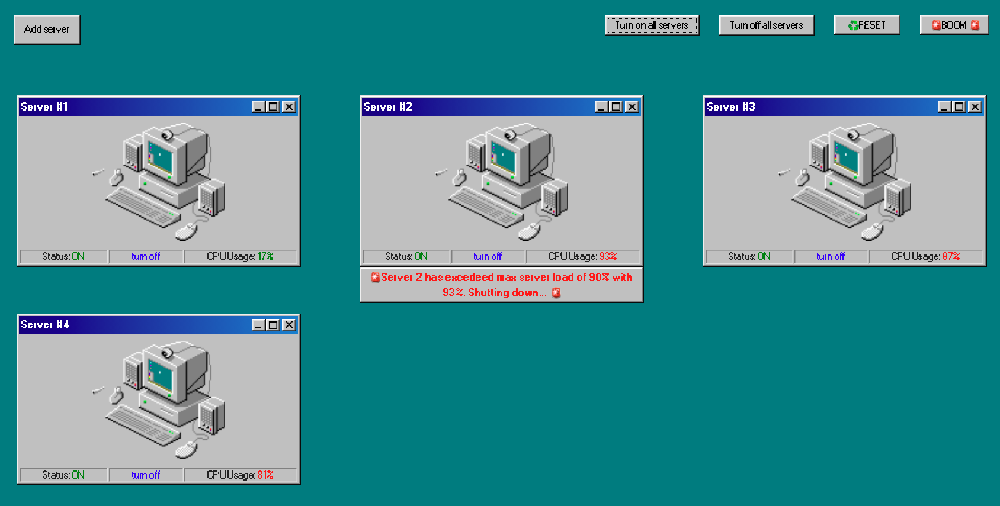

# Innovid challenge: Load balancer
Tenemos que crear una aplicación que muestre la carga de nuestros servidores 1, 2, 3 y 4, lamentablemente nuestro backend no tiene implementado un método para obtenerlos todos al mismo tiempo así que hay que traerlos de a uno, en paralelo.

## Frontend
* Debe mostrar la carga de los cuatro servidores.
* La carga se debe actualizar cada 5 segundos.
* Puedo prender y apagar servidores (dejo de traerme su carga).

### Extra

* Botones para encender/apagar todos los servidores a la vez
* Botón para añadir servidores
* Botones para resetear a estado inicial/eliminar todos
* Capacidad máxima configurable para apagar servidor si carga lleva a dicho nivel

### Roadmap
* Añadir tests (al ser un challenge no se ha considerado importante, aunque debería serlo)
* Revisar errores Typescript confusos
* Añadir funcionalidades a los botones de ventana



## Corriendo el proyecto
```bash
# Instalar dependencias del proyecto
npm install

# Instalar dependencias de los paquetes
npm run bootstrap

# Correr el servidor de desarrollo
npm start
```

## Modalidad de entrega
* Repositorio público subido a GitHub, Gitlab, Bitbucket.
